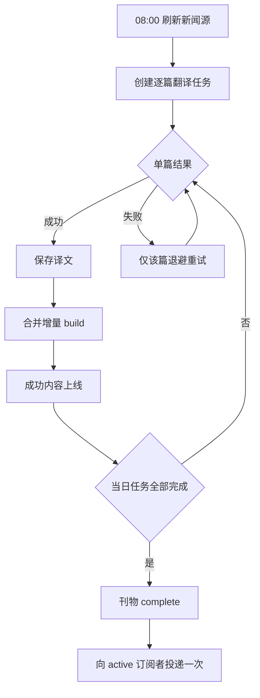

# Cheapcoding News

每天自动生成一期适合英语学习的双语新闻：从经过审核的英文新闻源获取内容，筛选重点文章，生成中文翻译与学习注解，增量发布为报纸风静态站点，并在当日刊物完成后向已确认订阅者投递一次简报。

[在线阅读](https://news.cheapcoding.top) · [快速部署](#快速部署) · [部署手册](deploy/README.md) · [运维手册](docs/OPERATIONS.md) · [技术路线](技术路线.md)

当前正式版：`v1.2.3`。项目通过 Docker Compose、Nginx、HTTPS 和 systemd timer 自托管到 Linux 服务器。

## 产品能力

### 每日双语刊物

- 每天 `08:00 Asia/Shanghai` 启动自动流程，聚合 BBC News、The Guardian、NPR、DW、Al Jazeera、France 24 等来源。
- 从最近 24 小时内容中去重、评分和选题，默认发布 6 篇主文章，并将其余合适内容编为简讯。
- 每篇内容保留来源、作者、发布时间和原文链接；正文抓取失败时降级为来源摘要，不影响其他文章。
- 首页采用编辑部报纸排版，支持来源筛选、往期归档和稳定刊期链接。
- 桌面与移动端均支持英文、双语、中文三种阅读模式，选择会在浏览器内保留。


### 英语精读

- 英文原文与中文译文按段对应，译文以编辑批注形式呈现。
- 文章页包含双语摘要、重点词汇、搭配和长难句解析；模型输出必须先通过正式 schema 校验才会入库。
- 支持整篇或逐段朗读，语速档位为慢速 `0.8`、正常 `0.9`、快速 `1.25`。
- AI 学习内容与原始来源明确区分；原文链接始终指向出版方页面。


### 订阅与邮件

- 公开订阅使用 double opt-in：提交邮箱后必须点击确认链接，未确认账号不会收到正式刊物。
- 公开订阅与 Admin 手工新增账号使用同一名单；正式投递只选择 `active` 账号。
- 支持一键退订、`List-Unsubscribe` 和 RFC 8058 one-click unsubscribe。
- Admin 可新增、停用、启用和删除账号，并且只显示脱敏邮箱和短标识。
- 正式刊物全部翻译、构建完成后才发送；调度重启、重复 build 或重复 worker 不会重复投递成功收件人。
- SMTP 支持 implicit TLS 与 STARTTLS。连接测试不发信，测试邮件和正式投递需要显式确认。
- DATA 阶段结果不确定时记录为 `unknown` 并停止自动重发，避免邮件可能已被服务端接受后再次投递。


### Admin 编辑台

生产环境的 `/admin/` 由登录页和会话 Cookie 保护。编辑台沿用主站的冷纸白、墨黑与朱砂红视觉，按职责分为五个工作区：

| 工作区 | 主要功能 |
|---|---|
| 模型接口 | 管理 OpenAI Chat / Anthropic Messages 兼容档案，启停档案并设置唯一默认项；可执行固定 `Hi` 连接测试和小型正式 schema 兼容测试 |
| 邮件设置 | 配置 SMTP、安全模式、发件人、主文章/简讯数量、语言、来源、摘要长度和版式；预览内容、测试连接和发送单账号测试邮件 |
| 订阅管理 | 查看统一订阅名单的脱敏状态；新增、停用、启用、删除账号；按单个 active 账号发送验证或测试刊物 |
| 翻译状态 | 实时查看逐篇任务、队列、worker、重试倒计时、provider 熔断和增量 build；支持单篇重试、终止和受控探测 |
| 投递状态 | 查看每个刊期和收件人的 `sent` / `failed` / `unknown`，只重试确定失败项，不混入翻译错误 |

所有配置写入服务器受限目录，不进入源码、镜像或页面响应；API key 与 SMTP 密码不会在 Admin 回显。

### 自动化翻译监控

`v1.2` 将每日翻译拆成持久化的逐篇任务。某一篇失败不会重跑已成功文章，也不会阻止成功内容先行上线：



翻译状态页通过 SSE 实时更新，连接断开时自动退化为短间隔轮询。每一行显示当前阶段、耗时、尝试次数、错误代码、下一次执行时间、build/上线状态和脱敏诊断 ID；非流式接口不会伪造百分比。

- 单篇失败从 `failed_at` 开始按 `15 秒 → 30 秒 → 60 秒 → 2 分钟 → 5 分钟`退避。
- 同一 provider 连续 5 次基础设施失败后打开熔断器，不影响网站、归档、Admin 或已上线内容。
- 熔断后自动探测依次等待 `60 秒 → 2 分钟 → 5 分钟`；同一时间最多一个 half-open 探测。
- “立即重试”只调度当前失败文章；“终止”先确认旧执行体结束；“立即探测”仍竞争持久 lease，重复点击不会创建第二个请求。
- 任务、lease、下一次重试、熔断、build 和投递幂等状态均保存在 SQLite，进程重启后继续恢复。


常见错误与系统动作：

| 错误代码 | 含义 | 自动处理 | 管理员操作 |
|---|---|---|---|
| `AUTH_401` | API 凭据无效 | 配置阻断 | 修正配置，保存并完成受控测试 |
| `AUTH_403` | 接口或模型无权限 | 配置阻断 | 检查账号与模型权限 |
| `RATE_LIMIT_429` | provider 限流 | 单篇退避并计入熔断 | 等待恢复或受控探测 |
| `PROVIDER_5XX` | provider 服务异常 | 单篇退避并计入熔断 | 通常等待自动恢复 |
| `NETWORK_CONNECT_FAILED` | DNS、代理或连接失败 | 单篇退避并计入熔断 | 检查网络与代理 |
| `REQUEST_TIMEOUT` | 请求达到硬超时 | 结束旧请求后退避 | 确认旧请求已停止 |
| `EMPTY_RESPONSE` | 返回内容为空 | 只重试当前文章 | 等待或立即重试 |
| `UNPARSEABLE_RESPONSE` | 响应无法解析 | 只重试当前文章 | 检查协议与模型兼容性 |
| `SCHEMA_VALIDATION_FAILED` | 内容不符合正式 schema | 只重试当前文章，不计入熔断 | 重试该篇或更换兼容模型 |
| `CONFIGURATION_INVALID` | 配置缺失或冲突 | 配置阻断 | 按“保存 → 测试 → 恢复”处理 |
| `REQUEST_CANCELLED` | 管理员终止请求 | 保留为待重试 | 确认原因后恢复该篇 |
| `CIRCUIT_OPEN` | provider 已熔断 | 暂停新的翻译请求 | 等待冷却或立即探测 |

### 移动端与可访问性

- 首页刊头在窄屏固定为两行语义信息：日期/星期一行，主文章/简讯数量一行，不拆散单位。
- 导航、来源筛选、阅读模式、订阅表单和 Admin 表格会在移动端重排，无横向滚动或文字遮挡。
- Admin 桌面使用紧凑表格，移动端转换为带字段标签的纵向任务列表；长标题、错误码和倒计时独立换行。
- 状态切换、loading 和结果反馈采用克制过渡，并完整支持 `prefers-reduced-motion`。
- 表单有明确 label、键盘焦点、`aria-live` 状态与忙碌状态；熟悉操作保持稳定按钮尺寸。

| 公开站点 390px | Admin 自动化监控 390px |
|---|---|
|  |  |

| 移动端订阅与支持区 |
|---|
|  |

以上截图均使用演示数据，不包含真实邮箱、密钥、provider 地址或 SMTP 响应。

### 归档与静态发布

每一期都有稳定 URL，归档页按日期列出头条和内容数量。构建过程先写临时目录，校验链接、资源与 release manifest 后才原子切换 `current`；构建失败时继续提供上一份有效站点。


## 本地体验

本地演示不需要 Docker、真实 provider 或 SMTP。适合先查看站点、订阅区和 Admin 自动化面板：

```bash
git clone https://github.com/Yi-Lings/news-digest.git
cd news-digest
uv sync --locked
uv run news-digest build --fixtures tests/fixtures/demo
uv run news-digest preview --port 8618 --automation-demo
```

打开 <http://127.0.0.1:8618/> 或 <http://127.0.0.1:8618/admin/>。`--automation-demo` 使用隔离 SQLite、固定任务和 fake provider，不会访问外部 API 或 SMTP。

## 快速部署

生产环境不在服务器检出源码。安装器从 GitHub Release 获取部署包，按同一 Release 的 worker/web immutable digest 拉取镜像，并把 SQLite、站点、配置和备份保留在目标 Linux 的持久化目录。根据你执行命令的位置选择下面一种流程。

### 1. Linux 服务器部署

此流程适合普通用户：先 SSH 登录目标服务器，再安装仓库已经发布的最新版本。

#### 前置条件

1. 目标机器使用 systemd，建议至少 1 GB 内存；以 root 登录或先执行 `sudo -i`。
2. 已安装 Docker Engine、Docker Compose v2、Nginx、Certbot、curl、tar、OpenSSL 和 sha256sum。
3. 准备一个域名或已有域名的子域名，例如 `news.example.com`。DNS `A` 记录必须指向服务器公网 IPv4；使用 IPv6 时再添加正确的 `AAAA` 记录。
4. 在云防火墙和服务器防火墙放行公网 `80`、`443`。等待 DNS 生效后再部署，安装器才能签发 HTTPS 证书并安全开放 Admin。
5. 确认 `ND_OWNER/news-digest` 已有包含部署包的 GitHub Release。私有 GHCR 镜像还需要一个只有 `read:packages` 权限的 PAT。

部署参数：

| 参数 | 是否必填 | 示例 | 用途 |
|---|---|---|---|
| `ND_OWNER` | 是 | `yi-lings` | GitHub/GHCR owner，必须全小写 |
| `ND_APP_DIR` | 是 | `/opt/news-digest` | 服务器绝对安装目录 |
| `ND_DOMAIN` | 是 | `news.example.com` | 站点域名、Nginx 与证书域名 |
| `ND_CERTBOT_EMAIL` | 是 | `ops@example.com` | HTTPS 证书通知邮箱 |
| `ND_WEB_PORT` | 否 | `8618` | Web 回环端口，默认 `8618` |
| `ND_ADMIN_PORT` | 否 | `8619` | Admin 回环端口，默认 `8619`，不得与 Web 相同 |

#### 安装步骤

1. SSH 登录服务器并进入 root shell：

```bash
ssh root@server.example.com
```

2. 普通用户保留官方 Release owner `ND_OWNER=yi-lings`，只替换安装目录、域名和证书邮箱：

```bash
ND_OWNER=yi-lings ND_APP_DIR=/opt/news-digest ND_DOMAIN=news.example.com ND_CERTBOT_EMAIL=ops@example.com bash <(curl -fsSL https://raw.githubusercontent.com/Yi-Lings/news-digest/main/deploy/install.sh)
```

如果 GitHub 仓库本身为私有，使用有仓库只读权限的 token 从 Contents API 下载入口脚本。token 通过隐藏输入读取，不写进命令历史：

```bash
export ND_OWNER=yi-lings ND_APP_DIR=/opt/news-digest ND_DOMAIN=news.example.com ND_CERTBOT_EMAIL=ops@example.com
read -rsp 'GitHub read-only token: ' GH_TOKEN; echo; export GH_TOKEN
bash <(curl -fsSL -H "Authorization: Bearer $GH_TOKEN" -H "Accept: application/vnd.github.raw" "https://api.github.com/repos/Yi-Lings/news-digest/contents/deploy/install.sh?ref=main")
unset GH_TOKEN
```

只有在自己的 fork 已经发布对应 GitHub Release 和 GHCR 镜像时，才把 `ND_OWNER=yi-lings` 改为 fork 的小写 owner，并同时将下载 URL 中的 `Yi-Lings/news-digest` 改为 fork 路径。

需要避开服务器已有端口时，在同一行增加 `ND_WEB_PORT=9000 ND_ADMIN_PORT=9001`。若镜像为私有且脚本提示缺少 GHCR 权限，执行 `docker login ghcr.io -u 你的GitHub用户名`，在密码提示中粘贴只读 PAT，再原样重跑安装命令；不要把 PAT 写进命令参数或仓库。

安装器会校验 Release、部署包和镜像 digest，执行服务器体检，创建配置目录与持久化 volume，启动 Web/Admin，安装每天 `08:00 Asia/Shanghai` 的 systemd timer，并配置 Nginx、HTTPS 和证书续期。安装阶段不会接收 API/SMTP 密钥，也不会获取 RSS、翻译、构建或投递。

#### 部署后配置与首次运行

1. 查看初始 Admin 口令；自定义过 `ND_APP_DIR` 时替换实际路径：

```bash
cat /opt/news-digest/config/admin-password.initial
```

2. 打开 `https://news.example.com/admin/`，以用户名 `admin` 登录并立即修改口令。
3. 在“模型接口”新增 provider，完成连接测试和正式 schema 测试，启用并设为唯一默认。`401` 表示鉴权失败，必须修正后再运行 worker。
4. SMTP 为可选配置。需要邮件时再保存 SMTP、测试连接并发送测试邮件；测试完成前保持 `EMAIL_DELIVERY_ENABLED=false`。
5. 回到服务器，启动第一次完整内容流程：

```bash
systemctl start news-digest.service
```

这条命令获取当日 RSS、选题、创建逐篇任务、翻译并构建主站；邮件投递开关关闭时会跳过投递。另开一个 SSH 窗口可查看实时日志：

```bash
journalctl -fu news-digest.service
```

首次任务成功后访问 `https://news.example.com/`。以后 timer 每天自动运行，也可以用同一条 `systemctl start` 命令人工补跑。

#### Linux 注意事项

- `8618` 和 `8619` 是仅绑定服务器回环地址的内部端口。公网用户只访问同一个 HTTPS 域名：`/` 由 Nginx 转发到 Web，`/admin/` 转发到 Admin。
- HTTPS 未成功时 Admin 不会通过明文 HTTP 开放。先检查 DNS 与公网 `80`，修复后原样重跑安装命令。
- 部署结束时主站可能返回 `404`，因为尚无刊物；完成第一次内容流程后才生成首页。
- bootstrap 可幂等重跑，不会覆盖 Admin 中保存的 provider、SMTP 或历史数据。不要并发启动多个 worker。

### 2. Windows：WSL 本地部署或远程部署 Linux

Windows 有两种用法：在本机 WSL 内直接安装已发布版本，或者使用 Windows OpenSSH 与 SSH Key，向任意 Linux 目标远程执行同一个 Release 安装器。

#### 2.1 在本机 WSL 部署

WSL 只有在能够满足 Linux 流程的全部前置条件时才可作为正式目标：systemd、有效公网域名、正确 DNS 和公网 `80/443` 都不可省略。没有这些条件时不要运行安装器，应使用上方“本地体验”的 `uv run ... preview` 命令。

在 Windows PowerShell 中，将示例值替换后执行：

```powershell
wsl -u root -- bash -lc 'ND_OWNER=yi-lings ND_APP_DIR=/opt/news-digest ND_DOMAIN=news.example.com ND_CERTBOT_EMAIL=ops@example.com bash <(curl -fsSL https://raw.githubusercontent.com/Yi-Lings/news-digest/main/deploy/install.sh)'
```

安装完成后通过 `https://news.example.com/` 与 `https://news.example.com/admin/` 访问。自定义端口时把 `ND_WEB_PORT`、`ND_ADMIN_PORT` 加在上述命令的 `bash -lc` 字符串内；这两个端口始终是 Nginx 的回环上游端口，不作为公网入口。

查看初始口令：

```powershell
wsl sudo cat /opt/news-digest/config/admin-password.initial
```

在 Admin 完成 provider 测试并设为唯一默认后，启动第一次内容流程：

```powershell
wsl sudo systemctl start news-digest.service
```

`systemctl start` 会等待任务结束。另开一个 PowerShell 窗口查看实时日志：

```powershell
wsl sudo journalctl -fu news-digest.service
```

SMTP 可以继续保持关闭。

#### 2.2 从 Windows 向任意 Linux 服务器部署

此流程适合普通用户从 Windows 安装仓库已经发布的最新版本，不需要在 Windows 克隆源码。目标既可以是启用了 SSH 的 WSL，也可以是任意远程 Linux 服务器。

Windows 前置条件：

1. 已安装 Windows OpenSSH Client。
2. SSH Key 能以 root 用户登录目标 Linux；首次运行前先用 `ssh -i KEY root@SERVER` 接受并核对服务器 host key。
3. 目标 Linux、域名、DNS、端口和依赖满足“Linux 服务器部署”的前置条件。

用户必须把以下示例值替换为自己的目标，命令不会自动猜测服务器：

| 信息 | 示例 | 用途 |
|---|---|---|
| 服务器 | `root@server.example.com` | SSH 用户与服务器地址 |
| SSH Key | `C:\keys\deploy_ed25519` | Windows 本机私钥路径 |
| GitHub owner | `yi-lings` | Release 与 GHCR owner |
| 安装目录 | `/opt/news-digest` | Linux 目标绝对路径 |
| 域名 | `news.example.com` | 已解析到目标服务器的域名 |
| 证书邮箱 | `ops@example.com` | HTTPS 证书通知邮箱 |

在 PowerShell 执行一行命令：

```powershell
ssh -i C:\keys\deploy_ed25519 root@server.example.com "bash -lc 'ND_OWNER=yi-lings ND_APP_DIR=/opt/news-digest ND_DOMAIN=news.example.com ND_CERTBOT_EMAIL=ops@example.com bash <(curl -fsSL https://raw.githubusercontent.com/Yi-Lings/news-digest/main/deploy/install.sh)'"
```

需要自定义 Web/Admin 回环端口时，在远程命令的 `ND_CERTBOT_EMAIL` 后增加 `ND_WEB_PORT=9000 ND_ADMIN_PORT=9001`。私有 GitHub 仓库或私有 GHCR 需要隐藏输入 token，建议先用 SSH 登录服务器，再按“Linux 服务器部署”的私有认证步骤操作。

部署完成后，先查看初始口令：

```powershell
ssh -i C:\keys\deploy_ed25519 root@server.example.com "cat /opt/news-digest/config/admin-password.initial"
```

打开 `https://news.example.com/admin/` 配置并测试 provider，可按需配置 SMTP。provider 启用并设为唯一默认后，从一个 PowerShell 窗口启动第一次内容流程：

```powershell
ssh -i C:\keys\deploy_ed25519 root@server.example.com "systemctl start news-digest.service"
```

另开一个 PowerShell 窗口查看实时日志：

```powershell
ssh -i C:\keys\deploy_ed25519 root@server.example.com "journalctl -fu news-digest.service"
```

#### Windows 注意事项

- 服务器地址、SSH Key、域名和安装目录由用户填写；本项目不会扫描或自动选择服务器。
- API Key、SMTP 密码不会从 Windows 读取或上传，必须在部署完成后通过 HTTPS Admin 保存。
- 远程命令只安装最新已发布 Release，不会推送源码、分支或 tag。仓库维护者的 `deploy.bat` 发布部署链见[技术路线](技术路线.md)。
- 不得把 API Key、SMTP 密码或完整 PAT 写入命令、日志或截图。

完整参数、私有仓库认证、手工部署、升级和回滚见[部署手册](deploy/README.md)。

## 常见问题

**今天没有更新**

```bash
systemctl status news-digest.timer
journalctl -u news-digest.service -n 100 --no-pager
```

先在 Admin 查看翻译状态。`AUTH_401/403` 和 `CONFIGURATION_INVALID` 应修正配置并测试，不能用重复重试代替；网络、限流和 5xx 通常交给自动退避与熔断恢复。

**站点打不开或返回 404**

```bash
cd /opt/news-digest
docker compose ps
curl http://127.0.0.1:8618/healthz
```

不要手工改 `current`、release manifest 或内容哈希。构建器会在校验通过后原子切换，并保留最近有效版本。

**测试邮件显示 `unknown`**

不要立即重发。`unknown` 表示 SMTP DATA 期间服务端可能已经接受邮件；先检查服务商队列和收件箱，再决定是否解除阻断。系统会持久化脱敏尝试状态，并阻止相同或新 idempotency key 绕过未解决状态。

**忘记 Admin 口令**

按[运维手册](docs/OPERATIONS.md)的口令恢复流程在服务器重置，并轮换会话密钥使旧登录全部失效；不要把新口令发到聊天、日志或命令行参数中。

## 数据、安全与可靠性

- SQLite 保存文章、译文、逐篇任务、订阅状态、投递状态和幂等记录；schema 迁移前执行一致性备份。
- 静态 release 使用临时构建、完整校验、manifest 内容哈希和原子 `current` 切换；失败不破坏上一版。
- provider 档案、SMTP 密码、Admin 口令和会话密钥只保存在权限受限的服务器配置目录。
- 外部抓取限制协议、来源、重定向、响应大小和私网目标，避免 SSRF 与异常资源消耗。
- Admin API 使用会话认证、CSRF、防缓存和安全响应头；生产 Admin 只监听宿主回环，由 Nginx 通过 HTTPS 暴露。
- 订阅确认、退订、测试邮件、正式投递和人工重试都有独立幂等边界。
- 邮件、日志、截图和诊断信息不得包含完整邮箱、API key、SMTP 密码、Base URL、文章正文或完整 provider 响应。

## 内容说明

内容取自各新闻来源公开 RSS 与可访问页面，版权归原出版方所有。本站保留来源标注和原文链接，AI 生成的中文与学习内容有明确说明；项目面向个人英语学习，不应被用于公开转载受版权保护的全文。

服务器维护见[运维手册](docs/OPERATIONS.md)，完整部署参数见[部署手册](deploy/README.md)，源码结构、本地运行、CLI 和二次开发见[技术路线](技术路线.md)。
