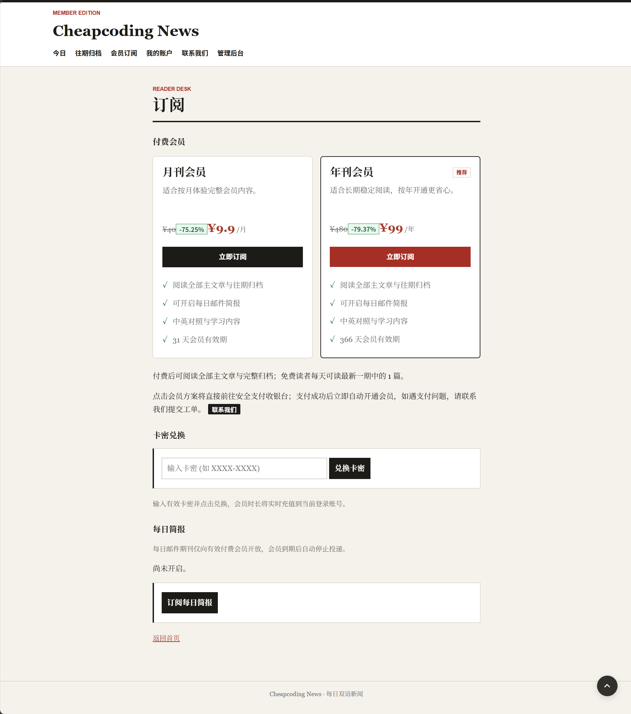
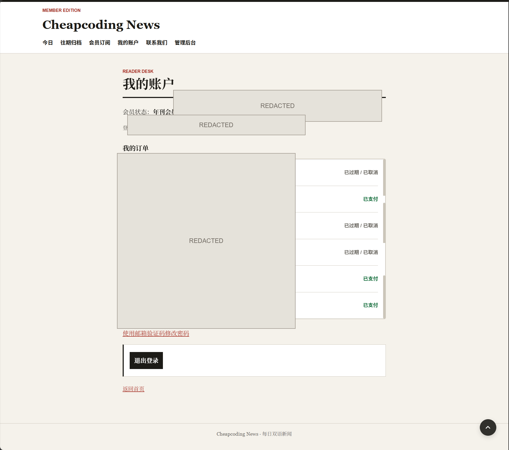
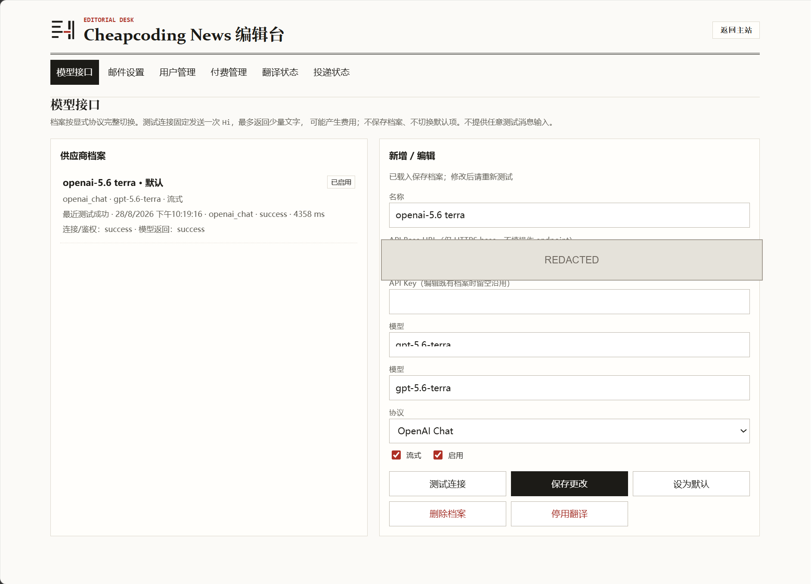
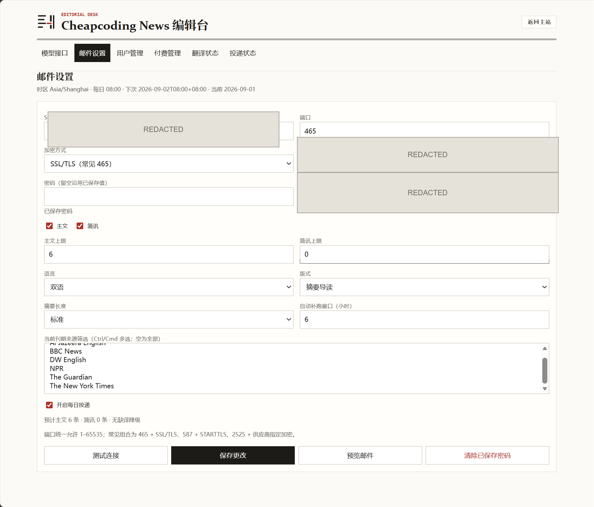
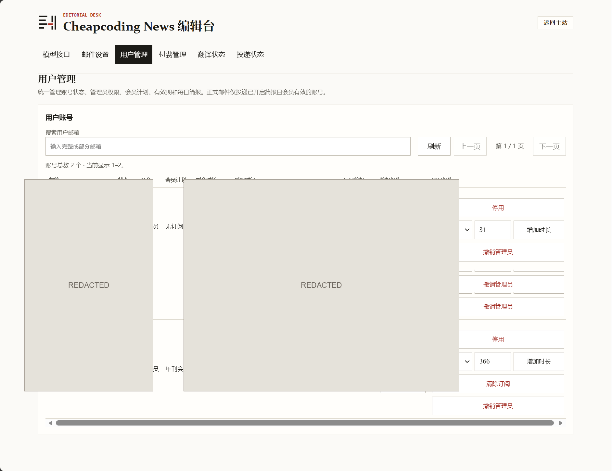
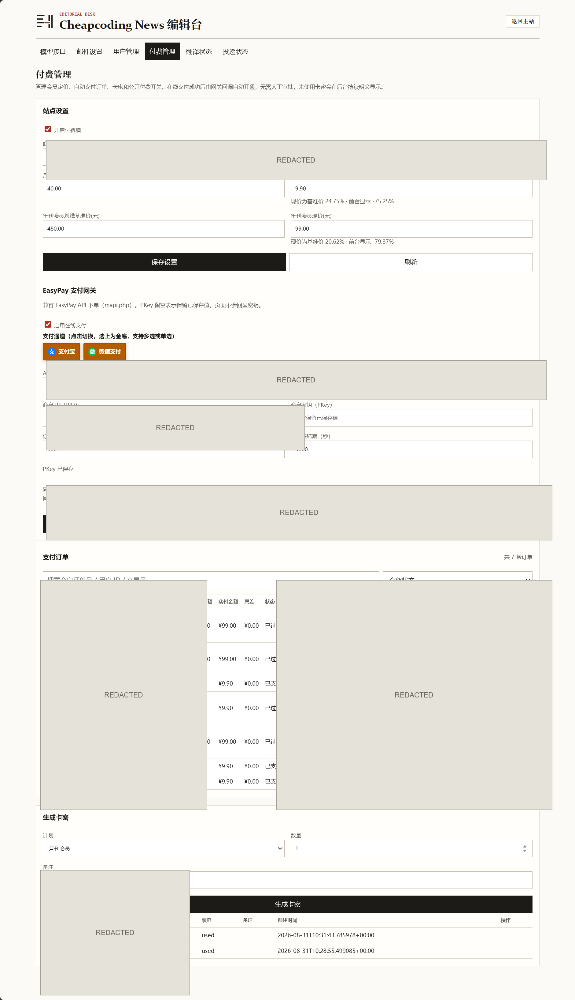
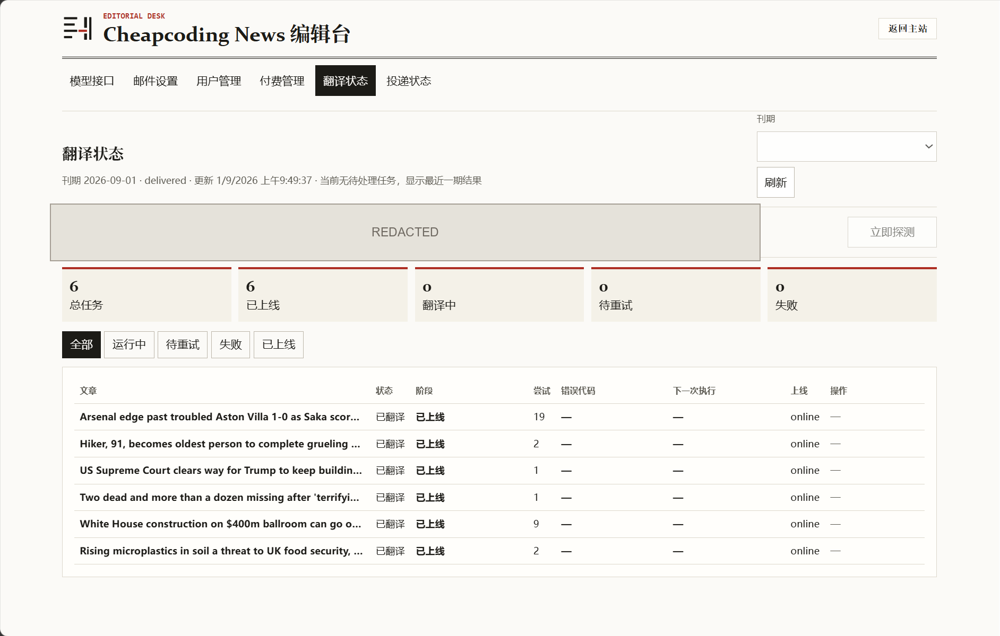
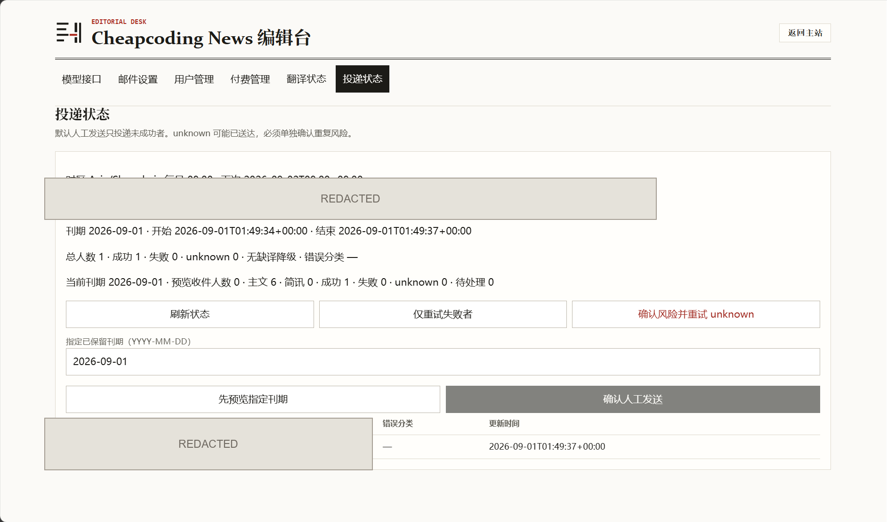
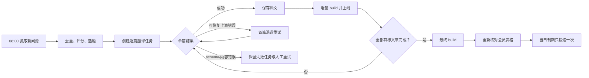

# Cheapcoding News

Cheapcoding News 是一份面向英语学习的每日双语新闻：每天聚合公开新闻源，筛选重点文章，生成英文原文、中文翻译和学习内容，发布为报刊风站点，并在刊期完整后向符合资格的会员投递每日简报。

[在线站点](https://news.cheapcoding.top/) · [GitHub Releases](https://github.com/Yi-Lings/news-digest/releases) · [v1.2.19 旧版完整说明](docs/releases/v1.2.19.md) · [部署手册](deploy/README.md) · [运维手册](docs/OPERATIONS.md) · [技术路线](技术路线.md)

当前主分支源码版本为 `1.4.0`。候选 tag 使用 `v1.4.0tN` 命名，稳定版与候选版都必须使用同一 Release 提供的 immutable image digest 部署；线上实际运行版本以 GitHub Release、部署台账和容器 revision 为准。

## 实际运行界面

下面的图片均于 2026-09-01 从实际运行中的 [news.cheapcoding.top](https://news.cheapcoding.top/) 采集，保留完整页面结构和关键操作状态。涉及账号、邮箱、订单/交易号、支付配置、SMTP 身份、Provider 地址以及诊断/收件人标识的区域均已做不可逆遮挡；新闻内容和日期会随每日刊期变化。

### 公开站点

首页以编辑部报刊布局展示当日主文章和简讯，支持来源筛选、英文/双语/中文阅读模式、往期归档、会员订阅和支持本站入口。文章页保留来源、发布时间、原文链接，并提供英文朗读、双语对照、重点词汇、搭配和长难句学习内容。


### 会员订阅与每日简报

会员订阅页将月刊会员、年刊会员、卡密兑换和每日简报放在同一条账户链路中：

- 月刊和年刊均以元定价，支持划线基准价、现价和绿色折扣标识；价格最多保留两位小数。
- 点击方案后直接创建订单并进入支付页；订单在“我的账户”中显示编号、会员类型、金额和状态，待支付订单可继续支付，过期或取消订单不会伪装成成功。
- EasyPay 兼容网关（包括 fastpay adapter）通过服务端下单和异步回调自动开通会员，回调验签、金额核对和重复通知幂等处理均在服务端完成。
- 卡密兑换后显示月刊会员/年刊会员和新的到期时间；管理员可以延期、清除或停用会员。
- 只有有效付费会员可以为已验证注册邮箱开启每日简报；会员到期自动停止投递，续费后保留简报选择。注册、改密和刊物投递共用 SMTP 服务，但使用不同模板。



### 注册、登录与归档

- 注册填写邮箱、两遍密码、随机图形验证码和邮箱验证码，并在提交前阅读并同意用户协议与隐私条款。
- 注册验证码只用于激活账号；激活后使用邮箱+密码登录。邮箱验证码不作为日常登录方式，仅用于忘记密码或修改密码。
- 归档页按日期选择刊期；主站底部的“按日期浏览”也只保留日期选择入口。


### 账户与 Admin 实际界面

账户页展示会员有效期、订单状态和密码修改入口；敏感账号及订单字段已遮挡。



Admin 沿用编辑台视觉，以下截图覆盖模型、邮件、用户、付费、翻译和投递六个工作区；敏感配置和运行标识已遮挡。














两张“翻译状态”截图来自同一状态、画面完全一致；按附件原样分别保留，便于对应用户提供的全部截图。

## 每日内容流水线

默认由 `Asia/Shanghai` 时区的 systemd timer 在每天 `08:00` 启动。流程以刊期和逐篇任务为单位，单篇失败不会删除同刊期已经成功的译文，也不会让站点回退到空白页。



### 抓取与选题

- 默认聚合 BBC News、The Guardian、NPR、DW、Al Jazeera、France 24 等已配置来源。
- 在时间窗口内去重、评分和选题，默认生成 6 篇主文章，其余合适内容进入简讯。
- 每篇内容保留来源、作者、发布时间和原文链接；正文抓取失败时可退回来源摘要，不影响其他文章。
- 每一期有稳定 URL 和日期归档；构建在临时目录完成校验后原子切换 `current`，构建失败时继续提供上一份有效站点。

### 翻译质量与恢复

- 正式翻译使用 OpenAI Chat Completions 或 Anthropic Messages 兼容协议，由 Admin 中唯一启用的默认 provider 决定。
- 输出必须通过正式 JSON schema、逐段逐句对应、数量、非空和内容质量检查后才入库；分句器和 prompt 版本会写入任务/缓存身份，避免旧缓存静默污染新协议。
- `400/401/403`、余额不足和权限拒绝统一记录为 `UPSTREAM_ERROR`，按单篇退避并计入 provider 熔断；只有本地配置前置校验失败才使用 `CONFIGURATION_INVALID`。
- 可恢复错误退避为 `15 秒 → 30 秒 → 60 秒 → 2 分钟 → 5 分钟`。同一 provider 连续 5 次基础设施失败后打开熔断，不停止网站、归档或 Admin。
- 熔断探测冷却为 `60 秒 → 2 分钟 → 5 分钟`，同一时间只允许一个探测 lease。配置修正后按“保存配置 → 受控测试 → 解除阻断”恢复任务。
- `EMPTY_RESPONSE`、`UNPARSEABLE_RESPONSE`、`SCHEMA_VALIDATION_FAILED` 和 `TASK_DATA_MISSING` 保留为可见的单篇失败，并提供“立即重试”；不会从列表中静默消失，也不会无限自动扣费重试。
- Admin 的“立即调度”“立即重试”“立即探测”和“终止”均写入持久动作队列；旧执行体确认结束或 lease 过期后才恢复为可重试状态，重复点击不会创建第二个 provider 请求。

### 投递

- 只有目标文章全部翻译成功、最终 build 完成且上线后，刊期才进入投递阶段。
- 每个收件人单独记录 `pending`、`sending`、`sent`、`failed` 或 `unknown`；重启、重复 build 和任务恢复不会重复投递已确认成功的收件人。
- SMTP 支持 implicit TLS 和 STARTTLS。连接测试不发信，测试邮件和正式投递都需要显式确认。
- SMTP DATA 阶段无法确认结果时记为 `unknown`，默认禁止盲目重发；只有管理员核对服务商队列后才能执行受控重试。
- 会员到期、主动退订或账号停用后，新的投递会被资格检查排除；历史投递审计保留。

## 账号、会员与权限

| 对象 | 规则 |
|---|---|
| 普通读者 | 可访问公开首页、简讯、注册/登录、隐私、联系我们和会员方案页。付费墙开启时，免费额度必须在确认页主动确认后使用。 |
| 付费会员 | 读取全部主文章与往期归档，可为自己的已验证注册邮箱开启每日简报；页面显示会员类型和到期时间。 |
| 站点管理员 | 管理员账号登录主站后才显示“管理后台”入口；运维管理员可在用户管理中授予或撤销其他 active 账号的管理员角色。 |
| 运维配置 | provider、SMTP、EasyPay、会话密钥和 Admin 初始口令只保存在服务器受限目录，不进入 Git、镜像或页面响应。 |

## Admin 管理台

生产 `/admin/` 由登录页和会话 Cookie 保护，沿用主站的冷纸白、墨黑与朱砂红视觉。当前分为六个工作区：

| 工作区 | 主要能力 |
|---|---|
| 模型接口 | 新增/编辑 OpenAI Chat 或 Anthropic Messages provider，启停、设置唯一默认、固定 `Hi` 连接测试和小型正式 schema 兼容测试。 |
| 邮件设置 | 配置 SMTP 安全模式、发件身份、主文章/简讯数量、语言、来源、摘要长度和版式；预览、连接测试和单账号测试邮件。 |
| 用户管理 | 单独管理注册账号、账号状态、管理员角色、月刊/年刊会员、剩余天数、到期时间和每日简报状态；支持延期、清除、启停和单账号测试投递。 |
| 付费管理 | 配置 EasyPay API Base、PID、PKey、支付类型、付费墙、月刊/年刊基准价与现价；查看订单、支付状态、尾差、交易号和错误代码；管理卡密。 |
| 翻译状态 | 查看刊期、逐篇任务、队列、worker、阶段、耗时、重试倒计时、错误代码、provider 熔断、增量 build 和上线状态；单篇重试、终止、恢复和受控探测。 |
| 投递状态 | 查看刊期和逐收件人 `sent` / `failed` / `unknown`，仅重试确定失败项，并显示归档和状态同步告警。 |

页面不会回显 API key、PKey、SMTP 密码、完整邮箱或完整 provider 响应；诊断 ID 和日志只使用脱敏信息。

## 本地体验

本地演示不需要 Docker、真实 provider、SMTP 或支付服务：

```bash
git clone https://github.com/Yi-Lings/news-digest.git
cd news-digest
uv sync --locked
uv run news-digest build --fixtures tests/fixtures/demo
uv run news-digest preview --port 8618 --automation-demo
```

打开 <http://127.0.0.1:8618/> 或 <http://127.0.0.1:8618/admin/>。`--automation-demo` 使用隔离 SQLite、固定任务和 fake provider，不访问外部 API 或 SMTP。真实 provider、SMTP、支付和生产数据测试必须单独授权，不要把密钥写入仓库。

## 生产部署与升级

服务器不检出源码、不在部署阶段构建镜像。GitHub Actions 生成 worker/web 镜像和部署包，生产 Compose 固定使用同一 Release 的 immutable digest；SQLite、配置、站点归档和备份保留在服务器持久化卷中。

### 新服务器

在目标 Linux 服务器以 root 执行，替换自己的域名、目录和证书邮箱：

```bash
ND_OWNER=yi-lings ND_APP_DIR=/opt/news-digest ND_DOMAIN=news.example.com ND_CERTBOT_EMAIL=ops@example.com bash <(curl -fsSL https://raw.githubusercontent.com/Yi-Lings/news-digest/main/deploy/install.sh)
```

安装器只安装已发布的稳定 Release，创建关闭状态的安全配置，启动 Web/Site/Admin，配置 HTTPS、每日 `08:00 Asia/Shanghai` timer 和恢复 path。安装过程不会抓取、翻译、构建、投递、支付或读取本地 `.env.local`。

安装后：

1. 在 `config/admin-password.initial` 读取初始 Admin 口令，登录后立即修改。
2. 在“模型接口”创建 provider，完成固定 `Hi` 和正式 schema 测试，启用并设为唯一默认。
3. 在“邮件设置”配置 SMTP，先做连接测试和单账号测试邮件，再开启正式投递。
4. 在“付费管理”配置 EasyPay-compatible 网关、月刊/年刊价格和支付回调，先用测试账号验收订单幂等与会员开通。
5. 在“用户管理”确认测试账号角色、会员到期时间和每日简报开关，再开启付费墙。

### 候选版本与升级

`v1.4.0tN` 是 prerelease，不能用“最新稳定版”安装器安装。候选版必须从对应 GitHub Release 取得 `digests.env`，再使用 [server-push.ps1](deploy/server-push.ps1) 的 worker/web digest 部署。升级前冻结 timer、daily worker、resume worker 和 wakeup path，先做 SQLite online backup 与 `PRAGMA integrity_check`；升级只切换镜像和服务，不自动触发业务流程。

完整参数、备份、回滚、Nginx、证书、GHCR read-only 和服务器核对命令见[部署手册](deploy/README.md)。日常故障处理见[运维手册](docs/OPERATIONS.md)。

## v1.2.19 与 v1.4.0 的边界

`v1.2.19` 是 1.2 系列最后一个“新闻流水线 + 邮件订阅”维护版；`v1.4.0` 是加入账号、会员和支付后的新产品线。两者不能把数据库字段、配置项或页面入口直接混用。

| 领域 | `v1.2.19` | `v1.4.0` |
|---|---|---|
| 产品对象 | 公开订阅名单和双语新闻 | 注册账号、月刊/年刊会员和会员简报 |
| 登录 | 无站点用户中心 | 邮箱验证码注册；邮箱+密码登录；验证码仅用于激活/重置 |
| 支付 | 无订单、支付或卡密 | EasyPay-compatible 自动支付、订单、尾差金额和卡密兑换 |
| 简报资格 | `active` 公开订阅记录即可收件 | 有效付费会员且主动开启每日简报 |
| Admin | provider、邮件、订阅、翻译、投递 | 独立用户管理、付费管理，并保留翻译/投递运维区 |
| 运行结构 | 静态 Web + Admin/preview 订阅 API | Web、Site、Admin 分离；Site 负责账号、付费墙和回调 |
| 数据库 | schema `7` | schema `10` |

旧版的完整功能、逐版本变更、迁移注意事项和不可混用边界已保存在[《v1.2.19 旧版发布说明》](docs/releases/v1.2.19.md)，该文档以不可移动的 `v1.2.19` tag 源码为准。

## 数据、安全与内容说明

- SQLite 保存文章、译文、翻译任务、账号、会员、订单、订阅、投递状态和幂等审计；schema 迁移前执行一致性备份。
- 静态发布使用临时目录、链接/资源校验、内容哈希和原子 `current` 切换；失败不破坏上一份有效站点。
- 外部抓取限制协议、重定向、响应大小和私网目标；provider 与 SMTP 连接也执行公网目标校验。
- Admin API 使用会话认证、CSRF、防缓存和安全响应头；生产 Admin 只监听宿主回环，由 Nginx 通过 HTTPS 暴露。
- 不在邮件、日志、截图、诊断信息或 Release 资产中输出完整邮箱、API key、SMTP 密码、PKey、Base URL、文章正文或完整上游响应。
- 新闻版权归原出版方所有；本站保留来源标注和原文链接，中文翻译与学习内容由 AI 生成，仅供个人英语学习，不应替代原文或用于未经授权的全文转载。

维护与二次开发入口：

- [CHANGELOG.md](CHANGELOG.md)：逐版本变更。
- [docs/releases/v1.2.19.md](docs/releases/v1.2.19.md)：旧版完整发布说明。
- [docs/OPERATIONS.md](docs/OPERATIONS.md)：本地和服务器日常操作、故障恢复。
- [deploy/README.md](deploy/README.md)：发布、部署、备份、回滚和 HTTPS。
- [技术路线.md](技术路线.md)：源码结构、CLI 和开发约定。
