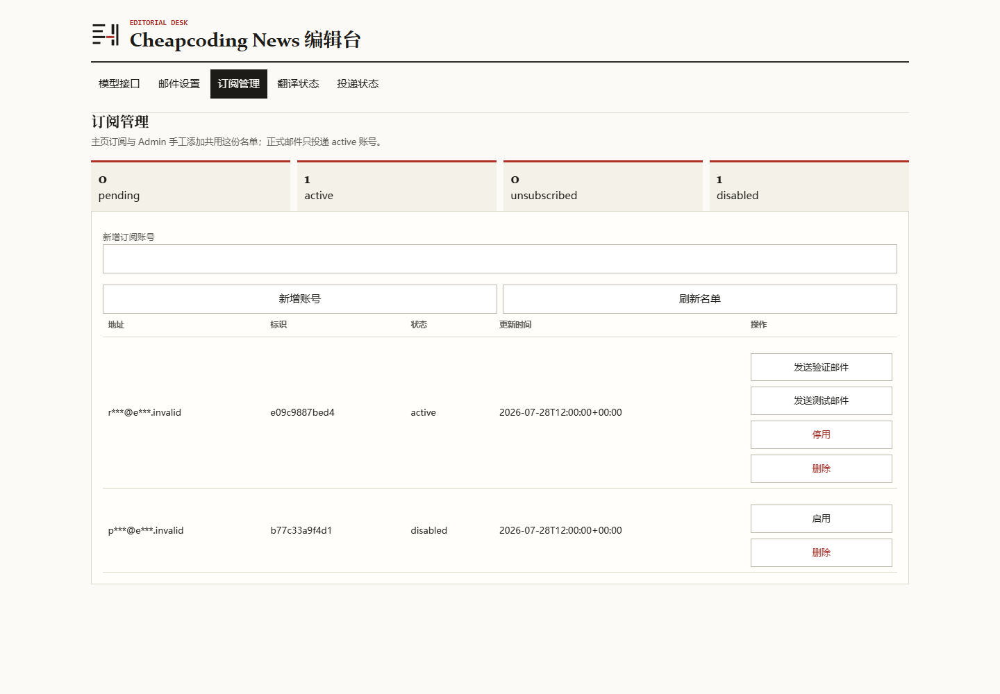
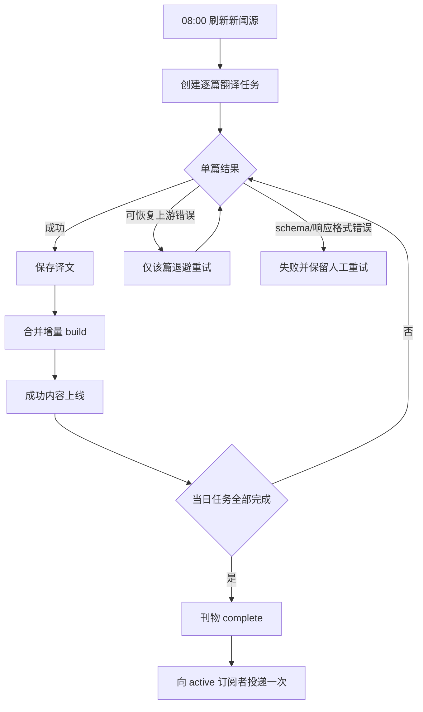
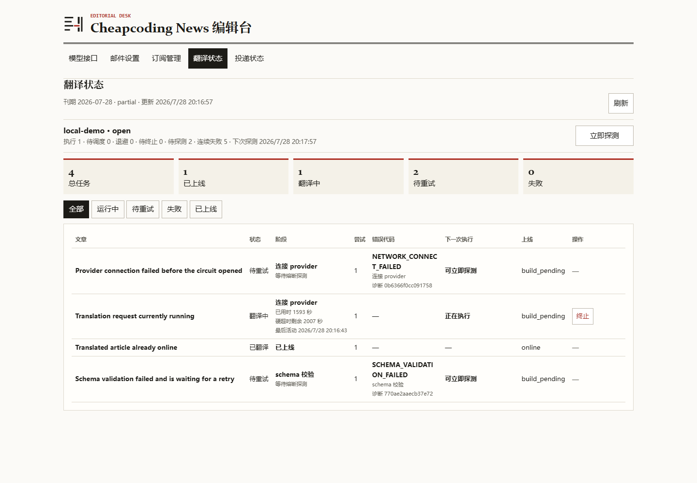
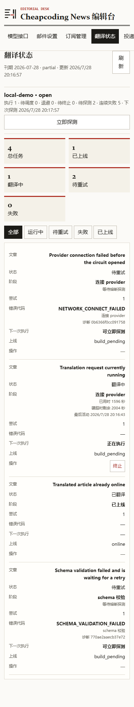

# Cheapcoding News

每天自动生成一期适合英语学习的双语新闻：从经过审核的英文新闻源获取内容，筛选重点文章，生成中文翻译与学习注解，增量发布为报纸风静态站点，并在当日刊物完成后向已确认订阅者投递一次简报。

[在线阅读](https://news.cheapcoding.top) · [快速部署](#快速部署) · [部署手册](deploy/README.md) · [运维手册](docs/OPERATIONS.md) · [技术路线](技术路线.md)

当前源码版本：`1.4.0`；生产环境当前运行测试候选 `v1.4.0t5`，本轮发布目标为 `v1.4.0t6`，正式 `v1.4.0` 尚未发布。测试候选包含翻译质量与任务恢复、账号注册/邮箱验证码、会员简报与付费墙、EasyPay 兼容自动支付、卡密兑换及 Admin 用户管理。

v1.4.0 的付费设置支持以元输入月付/年付基准价格（最多两位小数）和独立折扣百分比；有折扣时订阅页显示划线原价、绿色折扣标识与折后现价，订单保存创建时的折后金额。

## 产品能力

### 每日双语刊物

- 每天 `08:00 Asia/Shanghai` 启动自动流程，聚合 BBC News、The Guardian、NPR、DW、Al Jazeera、France 24 等来源。
- 从最近 24 小时内容中去重、评分和选题，默认发布 6 篇主文章，并将其余合适内容编为简讯。
- 每篇内容保留来源、作者、发布时间和原文链接；正文抓取失败时降级为来源摘要，不影响其他文章。
- 首页采用编辑部报纸排版，支持来源筛选、刊期日期选择、往期归档和稳定刊期链接；归档页也可直接选择已有日期跳转。
- 桌面与移动端均支持英文、双语、中文三种阅读模式，选择会在浏览器内保留。


### 英语精读

- 英文原文与中文译文按段对应，译文以编辑批注形式呈现。
- 文章页包含双语摘要、重点词汇、搭配和长难句解析；模型输出必须先通过正式 schema 校验才会入库。
- 支持整篇或逐段朗读，语速档位为慢速 `0.8`、正常 `0.9`、快速 `1.25`。
- AI 学习内容与原始来源明确区分；原文链接始终指向出版方页面。


### 订阅与邮件

- “会员订阅”和“每日简报”合并为统一页面；每日简报只向状态正常、付费未到期且主动开启简报的会员开放，收件地址固定为已验证注册邮箱。
- 会员到期后自动停止投递；续费后保留原简报选择并恢复投递资格。Admin 手工管理与会员自助选择使用同一名单。
- 支持一键退订、`List-Unsubscribe` 和 RFC 8058 one-click unsubscribe。
- Admin 可管理会员简报状态；读者只能为自己的已验证注册邮箱启停，会员到期后自动失去投递资格。
- 正式刊物全部翻译、构建完成后才发送；调度重启、重复 build 或重复 worker 不会重复投递成功收件人。
- SMTP 支持 implicit TLS 与 STARTTLS。连接测试不发信，测试邮件和正式投递需要显式确认。
- DATA 阶段结果不确定时记录为 `unknown` 并停止自动重发，避免邮件可能已被服务端接受后再次投递。
- 已完成的 `manual`、`retry_failed` 或经管理员确认风险后的 `retry_unknown` 批次，会在收件人结果全部确定、刊期内容全部上线且没有待处理付费目标时，原子归并刊期为 `delivered` 并清除旧投递错误。归并只同步状态，不发送邮件，也不会覆盖租约未过期的自动投递认领；过期认领只有在不存在未决收件人后才可由同一事务安全收口。
- 归并条件不足时返回 `blocked` 并保留原刊期状态；若收件人投递事实已持久化但汇总同步失败，CLI 与 Admin 显示 `state_sync_failed` 和“禁止重发”告警。此时必须检查投递审计，不得把汇总失败当作 SMTP 失败再次发送。




### 账号、会员与付费阅读

- 注册与登录使用独立页面：注册依次填写邮箱、两遍密码和随机图形验证码，获取邮箱验证码后提交完成激活；验证码不会建立登录会话，激活后仅支持邮箱与密码登录。邮箱验证码也用于忘记/修改密码，密码重置会撤销该账号全部旧会话。
- 付费墙关闭时全站免费；开启后，匿名或免费用户在确认页主动确认后，才会把当日免费额度用于最新一期中的一篇主文章；其他主文章与归档正文显示开通引导，付费用户可完整阅读。
- Admin 可分别以元设置月付/年付基准价（如 `9.9`）与折扣；接口和数据库仍以整数分保存。折扣金额向下取整到分；订单创建时冻结当时的折后金额，后续改价不影响已有订单。
- 开通方式支持 EasyPay 兼容网关自动支付和卡密兑换。站点按 `sub2api` 的 API 模式向 `mapi.php` 发起服务端 POST，下单成功后再跳转网关返回的支付页；订单号固定使用 `news_` 命名空间，异步回调固定为 `/subscribe/api/payment/easypay`。站内订单使用基准价 `±0.10`、步长 `0.01` 的唯一尾差，网关回调验签、核对商户号/支付类型/订单号/网关交易号及精确金额后原子开通；重复回调不会重复加时。
- 正常支付无需 Admin 人工审批。订单过期后金额继续冻结，避免迟付匹配到新用户；Admin 可查看支付状态、商户订单号、实付金额、尾差、网关交易号和错误代码。

### Admin 编辑台

生产环境的 `/admin/` 由登录页和会话 Cookie 保护。编辑台沿用主站的冷纸白、墨黑与朱砂红视觉，按职责分为六个工作区：

| 工作区 | 主要功能 |
|---|---|
| 模型接口 | 管理 OpenAI Chat / Anthropic Messages 兼容档案，启停档案并设置唯一默认项；可执行固定 `Hi` 连接测试和小型正式 schema 兼容测试 |
| 邮件设置 | 配置 SMTP、安全模式、发件人、主文章/简讯数量、语言、来源、摘要长度和版式；预览内容、测试连接和发送单账号测试邮件 |
| 订阅管理 | 查看统一订阅名单的脱敏状态；新增、停用、启用、删除账号；按单个 active 账号发送验证或测试刊物 |
| 用户与付费 | 管理登录用户、管理员角色、自动支付订单和卡密；配置 EasyPay API Base、PID、PKey、支付类型、付费墙、月付/年付基准价与独立折扣；查看基准/实付金额、尾差、网关交易号和错误代码 |
| 翻译状态 | 实时查看逐篇任务、队列、worker、重试倒计时、provider 熔断和增量 build；支持单篇重试、终止和受控探测 |
| 投递状态 | 查看每个刊期和收件人的 `sent` / `failed` / `unknown`，只重试确定失败项，不混入翻译错误 |

所有配置写入服务器受限目录，不进入源码、镜像或页面响应；API key 与 SMTP 密码不会在 Admin 回显。
运维管理员可把任意 active 站点账号设为管理员；只有管理员账号登录主站后才显示“管理后台”，点击可直接进入 `/admin/`。停用、撤权或密码重置会立即使其 Admin 会话失效，且站点管理员不能修改运维管理员口令。

服务器命令行也可授予或撤销管理员权限；账号必须先完成注册并激活。缺少 `--yes` 时只显示计划，不写数据库：

```bash
docker compose -f /srv/news-digest/compose.yaml run --rm worker site-admin --email ACCOUNT_EMAIL
docker compose -f /srv/news-digest/compose.yaml run --rm worker site-admin --email ACCOUNT_EMAIL --yes
docker compose -f /srv/news-digest/compose.yaml run --rm worker site-admin --email ACCOUNT_EMAIL --revoke --yes
```

### 自动化翻译监控

`v1.2` 将每日翻译拆成持久化的逐篇任务。某一篇失败不会重跑已成功文章，也不会阻止成功内容先行上线：



翻译状态页通过 SSE 实时更新，连接断开时自动退化为短间隔轮询。每一行显示当前阶段、耗时、尝试次数、错误代码、下一次执行时间、build/上线状态和脱敏诊断 ID；非流式接口不会伪造百分比。
翻译状态按刊期查看；日期选择器只显示存在待处理（pending/running）或失败、待重试、配置阻断、已取消任务的日期，默认打开最新待处理刊期；无待处理日期时显示最近一期完整结果。

- 可恢复的上游基础设施失败从 `failed_at` 开始按 `15 秒 → 30 秒 → 60 秒 → 2 分钟 → 5 分钟`退避；schema、响应格式和任务数据错误不自动循环重试。
- 同一 provider 连续 5 次基础设施失败后打开熔断器，不影响网站、归档、Admin 或已上线内容。
- 熔断后自动探测依次等待 `60 秒 → 2 分钟 → 5 分钟`；同一时间最多一个 half-open 探测。
- “立即调度”用于尚未启动的 pending 文章；“立即重试”只调度当前失败文章；“终止”先确认旧执行体结束；“立即探测”仍竞争持久 lease，重复点击不会创建第二个请求。
- 上游 HTTP `400/401/403`、余额不足和权限拒绝统一记录为 `UPSTREAM_ERROR`，按单篇退避与 provider 熔断处理；只有本地配置前置校验失败才使用 `CONFIGURATION_INVALID`。
- `EMPTY_RESPONSE`、`UNPARSEABLE_RESPONSE`、`SCHEMA_VALIDATION_FAILED` 和 `TASK_DATA_MISSING` 停在 `failed`，保留“立即重试”按钮；修正协议、模型或任务数据后再人工重试。
- provider 已恢复为 `closed` 时，历史配置阻断任务通过“保存配置 → 成功受控测试 → 解除阻断”恢复为可调度；解除动作返回持久 `action_id` 并保留审计。
- “等待终止确认”在 lease 过期后显示“恢复为可重试”。该动作只排队恢复，由 worker 确认旧执行体已结束，不会直接强制重发。
- 生产 Admin 成功入队后会通过受限 systemd path 唤醒独立恢复 worker；HTTP 请求本身不调用 provider，每日 worker 与恢复 worker 使用同一宿主锁串行。
- 任务、lease、下一次重试、熔断、build 和投递幂等状态均保存在 SQLite，进程重启后继续恢复。



常见错误与系统动作：

| 错误代码 | 含义 | 自动处理 | 管理员操作 |
|---|---|---|---|
| `UPSTREAM_ERROR` | 上游 HTTP `400/401/403`、余额或权限拒绝 | 单篇退避并计入熔断 | 检查 provider 余额/权限，修正后重试或受控探测 |
| `RATE_LIMIT_429` | provider 限流 | 单篇退避并计入熔断 | 等待恢复或受控探测 |
| `PROVIDER_5XX` | provider 服务异常 | 单篇退避并计入熔断 | 通常等待自动恢复 |
| `NETWORK_CONNECT_FAILED` | DNS、代理或连接失败 | 单篇退避并计入熔断 | 检查网络与代理 |
| `REQUEST_TIMEOUT` | 请求达到硬超时 | 结束旧请求后退避 | 确认旧请求已停止 |
| `EMPTY_RESPONSE` | 返回内容为空 | 停止自动重试，保留失败状态 | 检查模型输出后手动重试 |
| `UNPARSEABLE_RESPONSE` | 响应无法解析 | 停止自动重试，保留失败状态 | 检查协议与模型兼容性后手动重试 |
| `SCHEMA_VALIDATION_FAILED` | 内容不符合正式 schema | 停止自动重试，不计入熔断 | 修正提示词/模型后手动重试 |
| `TASK_DATA_MISSING` | 任务引用的原文已不存在 | 停止自动重试，释放任务 lease | 恢复原文或重新生成任务后手动重试 |
| `CONFIGURATION_INVALID` | 本地配置缺失、字段冲突或前置校验失败 | 配置阻断 | 按“保存 → 测试 → 解除阻断”处理 |
| `REQUEST_CANCELLED` | 管理员终止请求 | 保留为待重试 | 确认原因后恢复该篇 |
| `CIRCUIT_OPEN` | provider 已熔断 | 暂停新的翻译请求 | 等待冷却或立即探测 |

### 移动端与可访问性

- 首页刊头在窄屏固定为两行语义信息：日期/星期一行，主文章/简讯数量一行，不拆散单位。
- 导航、来源筛选、阅读模式、订阅表单和 Admin 表格会在移动端重排，无横向滚动或文字遮挡。
- Admin 桌面使用紧凑表格，移动端转换为带字段标签的纵向任务列表；长标题、错误码和倒计时独立换行。
- 状态切换、loading 和结果反馈采用克制过渡，并完整支持 `prefers-reduced-motion`。
- 表单有明确 label、键盘焦点、`aria-live` 状态与忙碌状态；熟悉操作保持稳定按钮尺寸。

| 公开站点 390px | Admin 自动化监控 390px |
|---|---|
|  |  |

| 移动端订阅与支持区 |
|---|
|  |

以上截图均使用演示数据，不包含真实邮箱、密钥、provider 地址或 SMTP 响应。

### 归档与静态发布

每一期都有稳定 URL，归档页按日期列出头条和内容数量。构建过程先写临时目录，校验链接、资源与 release manifest 后才原子切换 `current`；构建失败时继续提供上一份有效站点。


## 本地体验

本地演示不需要 Docker、真实 provider 或 SMTP。适合先查看站点、订阅区和 Admin 自动化面板：

```bash
git clone https://github.com/Yi-Lings/news-digest.git
cd news-digest
uv sync --locked
uv run news-digest build --fixtures tests/fixtures/demo
uv run news-digest preview --port 8618 --automation-demo
```

打开 <http://127.0.0.1:8618/> 或 <http://127.0.0.1:8618/admin/>。`--automation-demo` 使用隔离 SQLite、固定任务和 fake provider，不会访问外部 API 或 SMTP。

## 快速部署

生产环境不在服务器检出源码。安装器从 GitHub Release 获取部署包，按同一 Release 的 worker/web immutable digest 拉取镜像，并把 SQLite、站点、配置和备份保留在目标 Linux 的持久化目录。根据你执行命令的位置选择下面一种流程。

### 1. Linux 服务器部署

此流程适合普通用户：先 SSH 登录目标服务器，再安装仓库已经发布的最新版本。

#### 前置条件

1. 目标机器使用 systemd，建议至少 1 GB 内存；以 root 登录或先执行 `sudo -i`。
2. 已安装 Docker Engine、Docker Compose v2、Nginx、Certbot、curl、tar、OpenSSL 和 sha256sum。
3. 准备一个域名或已有域名的子域名，例如 `news.example.com`。DNS `A` 记录必须指向服务器公网 IPv4；使用 IPv6 时再添加正确的 `AAAA` 记录。
4. 在云防火墙和服务器防火墙放行公网 `80`、`443`。等待 DNS 生效后再部署，安装器才能签发 HTTPS 证书并安全开放 Admin。
5. 确认 `ND_OWNER/news-digest` 已有包含部署包的 GitHub Release。私有 GHCR 镜像还需要一个只有 `read:packages` 权限的 PAT。

部署参数：

| 参数 | 是否必填 | 示例 | 用途 |
|---|---|---|---|
| `ND_OWNER` | 是 | `yi-lings` | GitHub/GHCR owner，必须全小写 |
| `ND_APP_DIR` | 是 | `/opt/news-digest` | 服务器绝对安装目录 |
| `ND_DOMAIN` | 是 | `news.example.com` | 站点域名、Nginx 与证书域名 |
| `ND_CERTBOT_EMAIL` | 是 | `ops@example.com` | HTTPS 证书通知邮箱 |
| `ND_WEB_PORT` | 否 | `8618` | Web 回环端口，默认 `8618` |
| `ND_ADMIN_PORT` | 否 | `8619` | Admin 回环端口，默认 `8619`，不得与 Web 相同 |
| `ND_SITE_PORT` | 否 | `8620` | 动态读者站点回环端口，默认 `8620`，不得与其他端口相同 |

#### 安装步骤

1. SSH 登录服务器并进入 root shell：

```bash
ssh root@server.example.com
```

2. 普通用户保留官方 Release owner `ND_OWNER=yi-lings`，只替换安装目录、域名和证书邮箱：

```bash
ND_OWNER=yi-lings ND_APP_DIR=/opt/news-digest ND_DOMAIN=news.example.com ND_CERTBOT_EMAIL=ops@example.com bash <(curl -fsSL https://raw.githubusercontent.com/Yi-Lings/news-digest/main/deploy/install.sh)
```

如果 GitHub 仓库本身为私有，使用有仓库只读权限的 token 从 Contents API 下载入口脚本。token 通过隐藏输入读取，不写进命令历史：

```bash
export ND_OWNER=yi-lings ND_APP_DIR=/opt/news-digest ND_DOMAIN=news.example.com ND_CERTBOT_EMAIL=ops@example.com
read -rsp 'GitHub read-only token: ' GH_TOKEN; echo; export GH_TOKEN
bash <(curl -fsSL -H "Authorization: Bearer $GH_TOKEN" -H "Accept: application/vnd.github.raw" "https://api.github.com/repos/Yi-Lings/news-digest/contents/deploy/install.sh?ref=main")
unset GH_TOKEN
```

只有在自己的 fork 已经发布对应 GitHub Release 和 GHCR 镜像时，才把 `ND_OWNER=yi-lings` 改为 fork 的小写 owner，并同时将下载 URL 中的 `Yi-Lings/news-digest` 改为 fork 路径。

需要避开服务器已有端口时，在同一行增加 `ND_WEB_PORT=9000 ND_ADMIN_PORT=9001 ND_SITE_PORT=9002`。若镜像为私有且脚本提示缺少 GHCR 权限，执行 `docker login ghcr.io -u 你的GitHub用户名`，在密码提示中粘贴只读 PAT，再原样重跑安装命令；不要把 PAT 写进命令参数或仓库。

安装器会校验稳定 Release、部署包和镜像 digest，执行服务器体检，创建配置目录与持久化 volume，启动 Web/Site/Admin，安装每天 `08:00 Asia/Shanghai` 的 systemd timer，并配置 Nginx、HTTPS 和证书续期。安装阶段不会接收 API/SMTP 密钥，也不会获取 RSS、翻译、构建或投递。所有 `v1.4.0tN` 测试候选都是 prerelease，不成为 `releases/latest`，因此不能通过“最新稳定版”安装器误装；维护者按[部署手册](deploy/README.md)使用 `server-push.ps1` 和同一候选 Release 的 immutable digest 受控部署。

#### 部署后配置与首次运行

1. 查看初始 Admin 口令；自定义过 `ND_APP_DIR` 时替换实际路径：

```bash
cat /opt/news-digest/config/admin-password.initial
```

2. 打开 `https://news.example.com/admin/`，以用户名 `admin` 登录并立即修改口令。
3. 在“模型接口”新增 provider，完成连接测试和正式 schema 测试，启用并设为唯一默认。`401` 表示鉴权失败，必须修正后再运行 worker。
4. SMTP 为可选配置。需要邮件时再保存 SMTP、测试连接并发送测试邮件；测试完成前保持 `EMAIL_DELIVERY_ENABLED=false`。
5. 回到服务器，启动第一次完整内容流程：

```bash
systemctl start news-digest.service
```

这条命令获取当日 RSS、选题、创建逐篇任务、翻译并构建主站；邮件投递开关关闭时会跳过投递。另开一个 SSH 窗口可查看实时日志：

```bash
journalctl -fu news-digest.service
```

首次任务成功后访问 `https://news.example.com/`。以后 timer 每天自动运行，也可以用同一条 `systemctl start` 命令人工补跑。

#### Linux 注意事项

- `8618`、`8619`、`8620` 都是服务器内部端口。公网用户只访问同一个 HTTPS 域名：`/` 由 Nginx 转发到 Site（8620），`/admin/` 转发到 Admin（8619）；Web（8618）作为 compose 中保留的静态/健康服务，不是动态读者入口。
- HTTPS 未成功时 Admin 不会通过明文 HTTP 开放。先检查 DNS 与公网 `80`，修复后原样重跑安装命令。
- 部署结束时主站可能返回 `404`，因为尚无刊物；完成第一次内容流程后才生成首页。
- bootstrap 可幂等重跑，不会覆盖 Admin 中保存的 provider、SMTP 或历史数据。不要并发启动多个 worker。

### 2. Windows：WSL 本地部署或远程部署 Linux

Windows 有两种用法：在本机 WSL 内直接安装已发布版本，或者使用 Windows OpenSSH 与 SSH Key，向任意 Linux 目标远程执行同一个 Release 安装器。

#### 2.1 在本机 WSL 部署

WSL 只有在能够满足 Linux 流程的全部前置条件时才可作为正式目标：systemd、有效公网域名、正确 DNS 和公网 `80/443` 都不可省略。没有这些条件时不要运行安装器，应使用上方“本地体验”的 `uv run ... preview` 命令。

在 Windows PowerShell 中，将示例值替换后执行：

```powershell
wsl -u root -- bash -lc 'ND_OWNER=yi-lings ND_APP_DIR=/opt/news-digest ND_DOMAIN=news.example.com ND_CERTBOT_EMAIL=ops@example.com bash <(curl -fsSL https://raw.githubusercontent.com/Yi-Lings/news-digest/main/deploy/install.sh)'
```

安装完成后通过 `https://news.example.com/` 与 `https://news.example.com/admin/` 访问。自定义端口时把 `ND_WEB_PORT`、`ND_ADMIN_PORT` 加在上述命令的 `bash -lc` 字符串内；这两个端口始终是 Nginx 的回环上游端口，不作为公网入口。

查看初始口令：

```powershell
wsl sudo cat /opt/news-digest/config/admin-password.initial
```

在 Admin 完成 provider 测试并设为唯一默认后，启动第一次内容流程：

```powershell
wsl sudo systemctl start news-digest.service
```

`systemctl start` 会等待任务结束。另开一个 PowerShell 窗口查看实时日志：

```powershell
wsl sudo journalctl -fu news-digest.service
```

SMTP 可以继续保持关闭。

#### 2.2 从 Windows 向任意 Linux 服务器部署

此流程适合普通用户从 Windows 安装仓库已经发布的最新版本，不需要在 Windows 克隆源码。目标既可以是启用了 SSH 的 WSL，也可以是任意远程 Linux 服务器。

Windows 前置条件：

1. 已安装 Windows OpenSSH Client。
2. SSH Key 能以 root 用户登录目标 Linux；首次运行前先用 `ssh -i KEY root@SERVER` 接受并核对服务器 host key。
3. 目标 Linux、域名、DNS、端口和依赖满足“Linux 服务器部署”的前置条件。

用户必须把以下示例值替换为自己的目标，命令不会自动猜测服务器：

| 信息 | 示例 | 用途 |
|---|---|---|
| 服务器 | `root@server.example.com` | SSH 用户与服务器地址 |
| SSH Key | `C:\keys\deploy_ed25519` | Windows 本机私钥路径 |
| GitHub owner | `yi-lings` | Release 与 GHCR owner |
| 安装目录 | `/opt/news-digest` | Linux 目标绝对路径 |
| 域名 | `news.example.com` | 已解析到目标服务器的域名 |
| 证书邮箱 | `ops@example.com` | HTTPS 证书通知邮箱 |

在 PowerShell 执行一行命令：

```powershell
ssh -i C:\keys\deploy_ed25519 root@server.example.com "bash -lc 'ND_OWNER=yi-lings ND_APP_DIR=/opt/news-digest ND_DOMAIN=news.example.com ND_CERTBOT_EMAIL=ops@example.com bash <(curl -fsSL https://raw.githubusercontent.com/Yi-Lings/news-digest/main/deploy/install.sh)'"
```

需要自定义 Web/Admin/Site 回环端口时，在远程命令的 `ND_CERTBOT_EMAIL` 后增加 `ND_WEB_PORT=9000 ND_ADMIN_PORT=9001 ND_SITE_PORT=9002`。私有 GitHub 仓库或私有 GHCR 需要隐藏输入 token，建议先用 SSH 登录服务器，再按“Linux 服务器部署”的私有认证步骤操作。

部署完成后，先查看初始口令：

```powershell
ssh -i C:\keys\deploy_ed25519 root@server.example.com "cat /opt/news-digest/config/admin-password.initial"
```

打开 `https://news.example.com/admin/` 配置并测试 provider，可按需配置 SMTP。provider 启用并设为唯一默认后，从一个 PowerShell 窗口启动第一次内容流程：

```powershell
ssh -i C:\keys\deploy_ed25519 root@server.example.com "systemctl start news-digest.service"
```

另开一个 PowerShell 窗口查看实时日志：

```powershell
ssh -i C:\keys\deploy_ed25519 root@server.example.com "journalctl -fu news-digest.service"
```

#### Windows 注意事项

- 服务器地址、SSH Key、域名和安装目录由用户填写；本项目不会扫描或自动选择服务器。
- API Key、SMTP 密码不会从 Windows 读取或上传，必须在部署完成后通过 HTTPS Admin 保存。
- 远程命令只安装最新已发布 Release，不会推送源码、分支或 tag。仓库维护者的 `deploy.bat` 发布部署链见[技术路线](技术路线.md)。
- 不得把 API Key、SMTP 密码或完整 PAT 写入命令、日志或截图。

完整参数、私有仓库认证、手工部署、升级和回滚见[部署手册](deploy/README.md)。

### 生产升级与邮件边界

当前正确顺序为：当日目标文章全部翻译成功、全部上线且最终 build 完成后，只投递当日刊物一次；
更早刊期不会自动补发，也不会继续进入恢复 worker。被关闭自动投递资格的旧刊保留全部审计记录，
并在 Admin 显示 `DELIVERY_EXPIRED`。版本升级本身绝不触发抓取、翻译、构建或邮件投递。

升级前先冻结每日和恢复入口，确认没有 worker 正在运行：

```bash
systemctl stop news-digest.timer news-digest-wakeup.path news-digest-resume.service
systemctl reset-failed news-digest-resume.service
systemctl is-active news-digest.service news-digest-resume.service
```

两个 service 都应为 `inactive`。然后按“Linux 服务器部署”的同一条安装命令升级到最新
Release；安装器会做 SQLite online backup、按不可变 digest 更新镜像、重装 systemd unit，
并恢复 timer 与 wakeup path，但不会在部署过程中抓取、翻译、构建或投递。
timer/path 可以继续保持 `enabled`；preflight 与 bootstrap 只要求四个 unit 的 `ActiveState`
均非活动态，并在状态未知时 fail closed。

升级后只做无副作用核对：

```bash
docker compose -f /srv/news-digest/compose.yaml run --rm worker --version
systemctl is-enabled news-digest.timer news-digest-wakeup.path
systemctl is-active news-digest-wakeup.path news-digest-resume.service
systemctl cat news-digest.service | grep SuccessExitStatus
systemctl cat news-digest-resume.service | grep -E 'SuccessExitStatus|RestartPreventExitStatus|flock -E 75'
```

期望版本应与本次部署的 Release 一致；timer/path 为 `enabled`，wakeup path 为 `active`，
resume service 为 `inactive`；两个 service 都把应用终态 `10` 视为已处理，恢复 worker 不应每 15 秒重启。

不要直接启动恢复 worker 来“补齐”历史邮件。`DELIVERY_EXPIRED` 表示刊物内容仍保留在线，
但其自动投递资格已过期。只有当天刊期需要补投时，才在核对订阅者逐账号投递状态、SMTP
服务端队列以及所有 `unknown` 后，由管理员明确决定是否执行一次当日恢复；任何历史刊期都
不得自动补发，`unknown` 也不得盲目重发。

人工投递或失败项重试完成后，系统只在安全条件全部成立时归并自动化刊期状态。若 Admin
显示 `state_sync_failed`，表示收件人结果或批次事实已经保存，但刊期汇总仍被未完成结果、
并发状态或数据库异常阻断；页面会直接显示后端告警而不是普通成功提示。先核对投递批次与
逐收件人状态，禁止为了清除告警再次发送。

## 常见问题

**今天没有更新**

```bash
systemctl status news-digest.timer
journalctl -u news-digest.service -n 100 --no-pager
```

先在 Admin 查看翻译状态。上游 `400/401/403`、余额不足和权限拒绝显示为 `UPSTREAM_ERROR`，由自动退避与熔断恢复；只有 `CONFIGURATION_INVALID` 才需要按“保存 → 测试 → 解除阻断”处理。

**站点打不开或返回 404**

```bash
cd /opt/news-digest
docker compose ps
curl http://127.0.0.1:8618/healthz
curl http://127.0.0.1:8620/healthz
```

不要手工改 `current`、release manifest 或内容哈希。构建器会在校验通过后原子切换，并保留最近有效版本。

**测试邮件显示 `unknown`**

不要立即重发。`unknown` 表示 SMTP DATA 期间服务端可能已经接受邮件；先检查服务商队列和收件箱，再决定是否解除阻断。系统会持久化脱敏尝试状态，并阻止相同或新 idempotency key 绕过未解决状态。

**忘记 Admin 口令**

按[运维手册](docs/OPERATIONS.md)的口令恢复流程在服务器重置，并轮换会话密钥使旧登录全部失效；不要把新口令发到聊天、日志或命令行参数中。

## 数据、安全与可靠性

- SQLite 保存文章、译文、逐篇任务、用户、会员权益、订单、订阅状态、投递状态和幂等记录；schema 迁移前执行一致性备份。
- 静态 release 使用临时构建、完整校验、manifest 内容哈希和原子 `current` 切换；失败不破坏上一版。
- provider 档案、SMTP 密码、Admin 口令和会话密钥只保存在权限受限的服务器配置目录。
- 外部抓取限制协议、来源、重定向、响应大小和私网目标，避免 SSRF 与异常资源消耗。
- Admin API 使用会话认证、CSRF、防缓存和安全响应头；生产 Admin 只监听宿主回环，由 Nginx 通过 HTTPS 暴露。
- 订阅确认、退订、测试邮件、正式投递和人工重试都有独立幂等边界。
- 邮件、日志、截图和诊断信息不得包含完整邮箱、API key、SMTP 密码、Base URL、文章正文或完整 provider 响应。

## 内容说明

内容取自各新闻来源公开 RSS 与可访问页面，版权归原出版方所有。本站保留来源标注和原文链接，AI 生成的中文与学习内容有明确说明；项目面向个人英语学习，不应被用于公开转载受版权保护的全文。

服务器维护见[运维手册](docs/OPERATIONS.md)，完整部署参数见[部署手册](deploy/README.md)，源码结构、本地运行、CLI 和二次开发见[技术路线](技术路线.md)。
